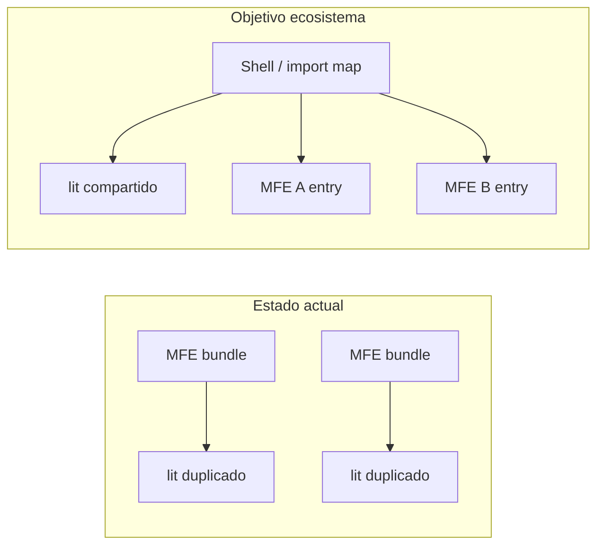

# Revisión crítica: package.json del arquetipo microfrontend

## Resumen

El [`package.json`](package.json) define un microfrontend SAS con Lit 2.7, dependencias internas `@sas/*`, doble servidor de desarrollo (Vite y Web Dev Server) y tests con `@web/test-runner` + Puppeteer. La base es razonable para un arquetipo (ESM, `engines`, Prettier embebido, scripts `build:dev` separado), pero hay **anti-patrones graves en el script `build`/`clean`**, **workspaces sin uso**, **cobertura de tests probablemente rota**, y **huecos de contrato MFE** (sin `exports`, sin externalización de `lit`, lockfile ignorado) que erosionan reproducibilidad y escalabilidad en producción.

El proyecto no tiene carpeta `packages/` ni `package-lock.json` versionado ([`.gitignore`](.gitignore) línea 32), lo que contradice un ecosistema npm workspaces maduro.

---

## Problemas detectados

### Scripts y flujo de build

| Problema | Impacto |
|--------|---------|
| `"build": "npm run version && npm run clean && npm i && vite build"` | Cada build **borra `node_modules` y `package-lock.json`** y reinstala. Lento, frágil en CI, no determinista, imposible cachear dependencias. |
| Script `"version"` imprime `node -v` / `npm -v` | Nombre engañoso; no gestiona semver ni alinea con `.sas-app.config`. |
| `"clean"` usa `npx -y rimraf` sin `rimraf` en `devDependencies` | Dependencia implícita de red en cada clean; en entornos sin registry falla. |
| `rimraf -rf` | API incorrecta para rimraf moderno (no usa flags estilo `rm -rf`). |
| No hay `typecheck`, `lint`, `format`, `preview`, `ci` | `tsc` existe pero no se encadena a build ni tests; el arquetipo no guía calidad en pipeline. |
| Dos entradas de dev: `start` (Vite) vs `start:wds` (WDS) | Sin documentación en README del arquetipo, equipos divergen; WDS además tiene bug: [`web-dev-server.config.mjs`](web-dev-server.config.mjs) usa `fileURLToPath` **sin importarlo** (a diferencia de WTR). |

### Gestión de dependencias

- **Rangos inconsistentes** en `@sas/*`: mezcla `1.X.X` y `1.x.x` (p. ej. `@sas/lib-stic-route` vs `@sas/wc-stic-button`). En npm los rangos son sensibles; unifica convención (recomendado: semver caret `^1.0.0` o rangos internos documentados).
- **`package-lock.json` en `.gitignore`**: sin lockfile en repo, cada `npm i` del script `build` puede resolver versiones distintas entre desarrolladores y pipelines.
- **`workspaces: ["./packages/**"]`** sin paquetes hijos: configuración muerta; confunde si el MFE es monorepo o app única.
- **Sin `peerDependencies` / `optionalDependencies`** para `lit` y posiblemente `@sas/wc-*`: riesgo de **duplicar Lit** en cada bundle MFE (el [`vite.config.ts`](vite.config.ts) tiene `external: /^lit/` comentado).
- **TypeScript 4.9.5** con **Vite 5.2.7**: desalineación; pierdes mejoras de tipado y compatibilidad con tooling actual (ideal TS ≥5.3 para Vite 5).
- **Prettier solo en `package.json`**, no como `devDependency` ni script `format`: IDE puede usar versión distinta a la del equipo.

### Testing

- `"test": "wtr --coverage"` sin **`@web/test-runner-coverage-v8`** (u otro plugin de cobertura) en `devDependencies`: flag `--coverage` **no tendrá efecto o fallará** según versión de WTR.
- **Puppeteer** (`@web/test-runner-puppeteer`): pesado en CI (Chrome descargado, `--no-sandbox` ya configurado en WTR). Válido pero costoso a escala; muchos equipos migran a Playwright o navegador del runner.
- Tests no integrados en `build` ni script `ci` explícito: fácil desplegar sin validación.
- Sin umbral de cobertura ni reporte CI (lcov) definido en package scripts.

### TypeScript y contrato del paquete

- `tsc` sin `noEmit` explícito en script de CI; [`tsconfig.json`](tsconfig.json) incluye `rootDir: "./"` amplio — aceptable para arquetipo pero conviene script `typecheck` con `-p` y política clara emit vs check.
- **Faltan campos de publicación MFE**: sin `files`, `exports`, `main`/`module`, `customElements`/entry documentado. Para consumo por shell (import maps, Module Federation, o `<script type="module">`), el arquetipo debería declarar **qué artefacto publica** (`dist/`).
- Nombre placeholder `@sas/app-stic-no-name` y versión `SNAPSHOT` sin script de alineación con [`.sas-app.config`](.sas-app.config).

### Escalabilidad microfrontends



- Build Vite en modo `lib` con `entry: 'index.html'` genera un patrón híbrido app+biblioteca; sin `rollupOptions.external` activo, **cada MFE empaqueta dependencias compartidas**.
- Sin script `build:watch` / `preview` para integración local con shell.
- Sin `packageManager` en `engines` (Corepack) para fijar npm 9+ en todo el ecosistema.

---

## Recomendaciones

### Build y desarrollo (prioridad alta)

1. **Separar responsabilidades**: `clean` solo `dist/` (y opcionalmente `coverage/`, `out-tsc/`); **nunca** `node_modules` ni lockfile en clean por defecto.
2. **`build` = `vite build`** (o `npm run typecheck && vite build`); **`build:ci`** con `npm ci` en pipeline, no dentro del script de build de la app.
3. Renombrar `version` → `env:check` o eliminarlo del build.
4. Añadir `preview` (`vite preview`), `dev` como alias de `start`, y documentar **un** servidor canónico (recomendación: **Vite** para alinear con producción; WDS solo si hay requisito legacy OWC).
5. Corregir import en `web-dev-server.config.mjs` o deprecar `start:wds`.

### Dependencias (prioridad alta)

1. **Versionar `package-lock.json`** y quitarlo de `.gitignore` en el arquetipo.
2. Unificar rangos `@sas/*` y documentar política (caret minor, o exact en release).
3. Añadir `rimraf` (o usar `vite build --emptyOutDir`) en devDependencies si se mantiene clean.
4. Valorar **`peerDependencies`: `{ "lit": "^2.7.4" }`** y activar `external` en Vite para dependencias provistas por shell/import map.
5. Subir **TypeScript a 5.x** y alinear `@types/*` si se añaden.

### Testing (prioridad media-alta)

1. Añadir `@web/test-runner-coverage-v8` y script `test:ci` sin `--watch`.
2. Script `ci`: `npm run typecheck && npm run test:ci && npm run build:dev` (o build completo según pipeline).
3. Evaluar reemplazo Puppeteer → `@web/test-runner-playwright` en CI corporativo.
4. Opcional: `test:unit` vs `test:integration` si crece el suite.

### TypeScript y calidad (prioridad media)

1. `"typecheck": "tsc --noEmit -p tsconfig.json"` y ejecutarlo en CI antes de build.
2. Añadir ESLint flat config + `lint` si el ecosistema SAS ya tiene preset compartido.
3. Mover Prettier a `.prettierrc` o `prettier` devDependency + `"format": "prettier --write ."`.

### Ecosistema MFE (prioridad media, arquitectura)

1. Definir **`exports`** del paquete apuntando al entry ESM del MFE (p. ej. `./dist/assets/index-*.js` estabilizado con `entryFileNames` fijo en Vite).
2. Documentar en README del arquetipo: contrato con shell, lista de **shared dependencies**, y si el MFE se carga por ruta o custom element raíz (`layout-container` en [`index.html`](index.html)).
3. Eliminar `workspaces` hasta existir `packages/`, o añadir paquete ejemplo `packages/shared-types`.
4. Campo `"packageManager": "npm@9.x.x"` junto a `engines`.

### Razonamiento clave

- **Reproducibilidad > conveniencia**: un arquetipo que destruye `node_modules` en cada build enseña un anti-patrón que se replica en decenas de MFEs.
- **MFEs comparten runtime**: externalizar `lit` y WC compartidos reduce peso y evita bugs por múltiples copias de LitElement.
- **El package.json es contrato**: sin `exports`/`files` y sin scripts `ci`/`typecheck`, cada equipo interpreta el pipeline distinto.
- **Cobertura sin plugin es deuda silenciosa**: el flag `--coverage` da falsa sensación de seguridad.

---

## package.json mejorado (propuesta)

Versión orientativa para el arquetipo; ajustar nombre `@sas/app-stic-*` y rangos `@sas/*` según registry interno.

```json
{
  "name": "@sas/app-stic-no-name",
  "version": "0.0.0-SNAPSHOT.1",
  "description": "no-description",
  "author": "SAS",
  "license": "SAS",
  "type": "module",
  "private": true,
  "files": ["dist"],
  "scripts": {
    "env:check": "node -v && npm -v",
    "clean": "rimraf dist coverage out-tsc",
    "dev": "vite",
    "start": "vite",
    "start:wds": "wds",
    "build": "npm run typecheck && vite build",
    "build:dev": "vite build --mode development",
    "preview": "vite preview --port 4200",
    "typecheck": "tsc --noEmit -p tsconfig.json",
    "test": "wtr",
    "test:watch": "wtr --watch",
    "test:coverage": "wtr --coverage",
    "test:ci": "wtr --coverage",
    "ci": "npm run typecheck && npm run test:ci && npm run build",
    "format": "prettier --write .",
    "format:check": "prettier --check ."
  },
  "dependencies": {
    "@sas/lib-stic-route": "^1.0.0",
    "@sas/wc-stic-button": "^1.0.0",
    "@sas/wc-stic-header": "^1.0.0",
    "@sas/wc-stic-navigation": "^1.0.0",
    "@sas/wc-stic-theme": "^1.0.0",
    "lit": "2.7.4"
  },
  "peerDependencies": {
    "lit": "^2.7.4"
  },
  "devDependencies": {
    "@open-wc/testing": "4.0.0",
    "@types/mocha": "10.0.6",
    "@web/dev-server": "0.4.3",
    "@web/dev-server-esbuild": "1.0.2",
    "@web/test-runner": "0.18.1",
    "@web/test-runner-coverage-v8": "0.6.0",
    "@web/test-runner-puppeteer": "0.16.0",
    "prettier": "3.2.5",
    "rimraf": "5.0.5",
    "tslib": "2.6.2",
    "typescript": "5.4.5",
    "vite": "5.2.7"
  },
  "engines": {
    "node": ">=18.0.0",
    "npm": ">=9.0.0"
  },
  "packageManager": "npm@9.9.0",
  "prettier": {
    "trailingComma": "es5",
    "tabWidth": 2,
    "semi": true,
    "singleQuote": true,
    "arrowParens": "avoid",
    "printWidth": 100
  }
}
```

**Cambios deliberados respecto al actual:**

- Eliminado `workspaces` hasta existan paquetes hijos.
- `build` sin `clean` + `npm i` destructivo.
- Scripts `typecheck`, `ci`, `test:coverage`, `preview`, `format`.
- `peerDependencies` + `files` como primer paso hacia contrato publicable.
- Plugins y herramientas explícitas (`rimraf`, `prettier`, `coverage-v8`).
- TypeScript 5.x (requiere validar compatibilidad con `@sas/*`).

**Fuera de package.json pero acoplado:** activar `external` en [`vite.config.ts`](vite.config.ts), versionar lockfile, corregir WDS, y definir `exports` con nombre de chunk estable cuando el equipo defina estrategia de carga en el shell.

---

## Alcance de esta revisión

Solo análisis y propuesta; no se modifican archivos. Tras confirmación, se pueden aplicar cambios al `package.json`, `.gitignore`, configs WTR/WDS/Vite y documentación del arquetipo.
