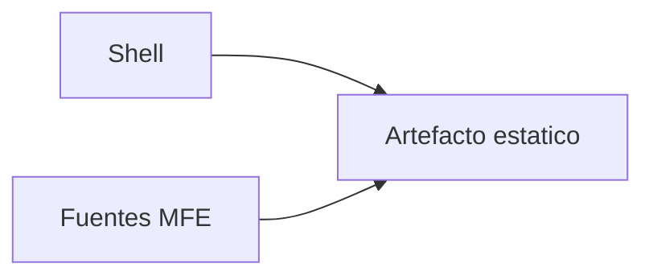

# Arquitectura del arquetipo microfrontend

Documento **conceptual**. Reglas de runtime: [SHELL-CONTRACT.md](../SHELL-CONTRACT.md).  
Estándar de organización frontend: [FRONTEND_STRUCTURE.md](./FRONTEND_STRUCTURE.md).

---

## Propósito del sistema

El repositorio implementa un **microfrontend (MFE)** con release propio, integrado en un **shell** que orquesta la experiencia global.



La interfaz shell ↔ artefacto se estabiliza en contrato (**G1**, **G2**).  
La interfaz entre equipos frontend se estabiliza en la estructura modular.

---

## Por qué una estructura modular frontend

En equipos grandes, la fricción no aparece solo en runtime: también aparece en el código cuando no hay convención estable de ubicación y responsabilidades.

La estructura modular se adopta para:

- separar dominios por bounded context (`src/module/<modulo>/`);
- sostener MVVM de forma uniforme;
- mejorar ownership y revisiones;
- mantener testabilidad con `test/` fuera de `src/`.

Detalle normativo: [FRONTEND_STRUCTURE.md](./FRONTEND_STRUCTURE.md).

---

## Bounded contexts y separación de responsabilidades

- `src/module/` organiza el dominio en unidades de producto.
- `src/shared/` se limita a reutilización transversal.
- `src/index.ts` orquesta la carga inicial, no concentra lógica de dominio.

Ejemplo actual del arquetipo:

```1:4:src/index.ts
import { bootstrapVacunasFichaVacunalMf } from '@app/bootstrap/bootstrap';
import { defineVacunasFichaVacunalMfElement } from '@app/vacunas-ficha-vacunal-mf.viewmodel';
void bootstrapVacunasFichaVacunalMf().then(() => defineVacunasFichaVacunalMfElement());
```

---

## MVVM como decisión arquitectónica

MVVM es una decisión de mantenibilidad, no solo de estilo.

- `*.view.ts`: composición visual y render.
- `*.viewmodel.ts`: estado y orquestación.

| Beneficio | Impacto |
|-----------|---------|
| Menos acoplamiento UI/lógica | Cambios visuales con menos regresión funcional |
| Revisión especializada | Front visual y lógica revisables por perfiles distintos |
| Mejor testabilidad | Pruebas más estables por capa |

Trade-off: mayor número de archivos y disciplina de naming.

---

## Decisiones de plataforma (resumen)

### Paquete estático

Sin Node en runtime; publicación por hosting estático. Implicaciones operativas: [DOCKER_DEPLOYMENT.md](./DOCKER_DEPLOYMENT.md).

### Lit en el host

Un runtime compartido de Lit (**L1–L7**), con validación en host real.

### Web Components como frontera

El shell integra por custom elements, sin acoplar framework interno.

### Chunks y entry

Build particionado con entry estable y chunks variables (**C1–C3**, **V1**, **I4**).

---

## Riesgos estructurales

| Riesgo | Relación con estándares |
|--------|--------------------------|
| Deriva entre equipos | **G1**, **G2** + FRONTEND_STRUCTURE |
| Lógica en vistas | reglas MVVM en FRONTEND_STRUCTURE |
| Fronteras difusas entre módulos | reglas de modularidad en FRONTEND_STRUCTURE |
| Runtime inconsistente | **I1–I4**, **L1–L6** |
| Publicación parcial | **D2**, **V2** |

---

## Evolución futura

- Formalizar APIs públicas entre módulos.
- Extender plantillas de `pages/` y `service/` en el arquetipo.
- Definir métricas por módulo (complejidad, cobertura, tamaño).

Cambio runtime: contrato. Cambio organizativo interno: FRONTEND_STRUCTURE.

---

## Documentación por capa

| Pregunta | Documento |
|----------|-----------|
| ¿Qué es obligatorio en runtime? | [SHELL-CONTRACT.md](../SHELL-CONTRACT.md) |
| ¿Cómo se organiza el código frontend? | [FRONTEND_STRUCTURE.md](./FRONTEND_STRUCTURE.md) |
| ¿Cómo integrar en el shell? | [SHELL_INTEGRATION.md](./SHELL_INTEGRATION.md) |
| ¿Cómo publicar en CI/CD? | [DOCKER_DEPLOYMENT.md](./DOCKER_DEPLOYMENT.md) |
| ¿Cómo empezar a desarrollar? | [GETTING_STARTED.md](./GETTING_STARTED.md) |
