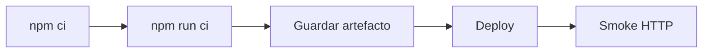

# CI/CD y despliegue estático

Documento de **pipeline y hosting**. Normativa del paquete publicado: [SHELL-CONTRACT.md](../SHELL-CONTRACT.md) (**D**, **V**, **E1**, **D4**).

---

## Requisitos

| Requisito | Valor |
|-----------|--------|
| Node.js | >= 18 |
| npm | >= 9 |
| Lockfile | `package-lock.json` |

---

## Comandos

| Comando | Efecto |
|---------|--------|
| `npm ci` | Instalación reproducible |
| `npm run build` | `typecheck` + `vite build` |
| `npm run ci` | `typecheck` + `test:ci` + `build` |
| `npm run clean` | Elimina salida de build, `coverage/`, `out-tsc/` |

Impacto de estructura frontend en esta capa: el runner usa tests en raíz (`test/**/*.test.ts`).

---

## Pipeline



| Fase | Acción | Éxito |
|------|--------|-------|
| Install | `npm ci` | Exit 0 |
| Gate | `npm run ci` | Pipeline verde |
| Artifact | Publicar salida de `npm run build` | Directorio completo en workspace |
| Deploy | rsync / S3 / imagen | Copia sin filtrar ficheros |
| Smoke | GET recursos estáticos | Sin 404 |

Cumplimiento del artefacto: **D2**, **V1**, **V2** — [SHELL-CONTRACT.md](../SHELL-CONTRACT.md).

```yaml
test_and_build:
  image: node:18
  script:
    - npm ci
    - npm run ci
  artifacts:
    paths:
      - dist/
    expire_in: 1 week

deploy_static:
  script:
    - rsync -av dist/ user@host:/var/www/releases/${RELEASE}/
  dependencies:
    - test_and_build
```

### Tests en CI

Runner con Chrome/Chromium para `@web/test-runner-puppeteer`.

```6:10:web-test-runner.config.mjs
files: 'test/**/*.test.ts',
nodeResolve: true,
preserveSymlinks: true,
browsers: [puppeteerLauncher({ launchOptions: { args: ['--no-sandbox', '--disable-setuid-sandbox'] } })],
```

---

## Artefacto

| Verificación pipeline | Regla |
|----------------------|--------|
| Salida = carpeta `dist/` del job | **D1** |
| Copia íntegra al hosting | **D2**, **D3** |
| Release atómico por versión | **V1**, **V2**, **I4** |
| Fichero entry presente post-build | **E1**, **D4** |

---

## Nginx

`nginx-conf/default.conf` — puerto **8080**.

```nginx
server {
  listen 8080;
  server_name localhost;
  root /usr/share/nginx/html;
  index index.html;

  location / {
    try_files $uri $uri/ /index.html;
  }

  location ~* \.(js|mjs|css)$ {
    add_header Cache-Control "public, max-age=31536000, immutable";
  }
}
```

1. `npm ci && npm run build`
2. Copiar contenido de `dist/` al `root`
3. Smoke: `GET /index.html` → 200; comprobar `.js` / `.css` servidos

Cabeceras `immutable`: **V4**.

---

## Docker

```dockerfile
FROM node:18-alpine AS build
WORKDIR /app
COPY package.json package-lock.json ./
RUN npm ci
COPY . .
RUN npm run build

FROM nginx:alpine
COPY --from=build /app/dist /usr/share/nginx/html
COPY nginx-conf/default.conf /etc/nginx/conf.d/default.conf
EXPOSE 8080
```

---

## Riesgos de pipeline

| Riesgo | Mitigación |
|--------|------------|
| Gate omitido | Rama protegida; `npm run ci` obligatorio |
| Artefacto truncado | Listado post-deploy; **D2** |
| Sync mezclando releases | Prefijo por **V1**; sync atómico |
| `immutable` incorrecto | **V4** |
| Runner sin navegador | Imagen con Chromium |

---

## Checklist DevOps

- [ ] `npm ci` + `npm run ci` en verde
- [ ] Artefacto completo publicado (**D2**)
- [ ] Release atómico (**V1**, **V2**)
- [ ] Smoke HTTP
- [ ] URL de release registrada para consumo downstream

Verificación de integración en host: contrato **R7** — [SHELL-CONTRACT.md](../SHELL-CONTRACT.md).
