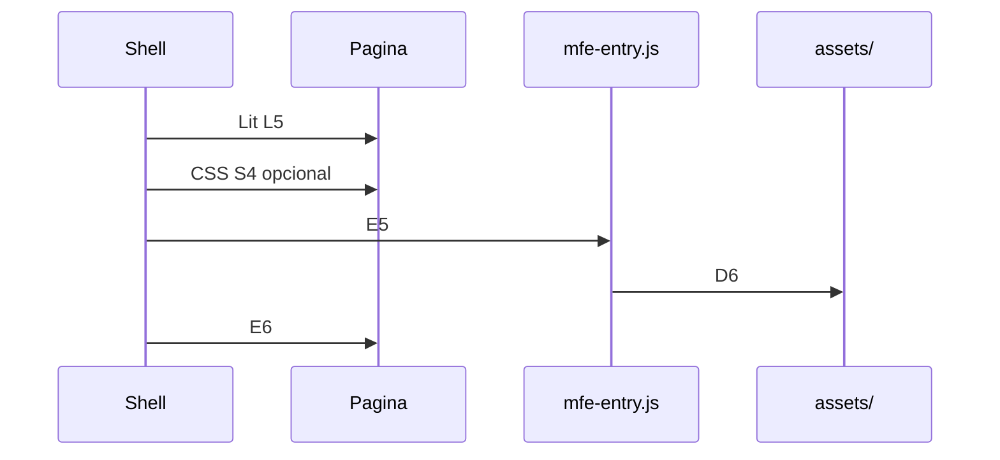

# Integración con el shell

Guía de **implementación shell ↔ MFE**. Normativa: [SHELL-CONTRACT.md](../SHELL-CONTRACT.md).  
Estructura interna frontend: [FRONTEND_STRUCTURE.md](./FRONTEND_STRUCTURE.md).

---

## Prerrequisitos

1. Contrato leído: **E**, **D**, **L**, **S**, **B**, **I**, **R7**.
2. Artefacto de release disponible (salida de pipeline; cumple **D1**).
3. Acordado: URL base (**B1** o **B2**) y modo CSS (**S3** o **S4**).

---

## Impacto de la estructura modular en integración

- El entry de integración permanece en `src/index.ts` (**E4**).
- El routing de aplicación importa vistas de `src/module/...`; esto alinea navegación y lazy loading por dominio.

Ejemplo real del arquetipo:

```13:18:src/routing/routes.ts
{
  path: '/counter',
  component: 'counter-component',
  name: 'Counter',
  action: async () => {
    await import('../module/counter/counter.view');
  },
},
```

Esta guía no define normas de modularidad interna; ver [FRONTEND_STRUCTURE.md](./FRONTEND_STRUCTURE.md).

---

## Flujo de carga en runtime



| Orden | Acción | Reglas |
|-------|--------|--------|
| 1 | Configurar resolución de `lit` | **L5**, **L1** |
| 2 | Publicar artefacto en URL base | **D2**, **D6**, **I3** |
| 3 | Cargar CSS global si aplica | **S4** |
| 4 | Cargar entry (ESM) | **E5**, **E7** |
| 5 | Montar custom element | **E6** |

---

## Resolver `lit` — import map

Ver **L1**, **L5**, **L7**.

```html
<script type="importmap">
{
  "imports": {
    "lit": "https://static.ejemplo.internal/shared/lit/2.7.4/lit.min.js",
    "lit/": "https://static.ejemplo.internal/shared/lit/2.7.4/"
  }
}
</script>
```

## Resolver `lit` — bundle del shell

Si el grafo del shell ya expone el specifier `lit` compatible con **L7**, el import map puede ser innecesario. Validar **I1** en consola (sin *Multiple versions of Lit loaded*).

---

## URL base del artefacto

`BASE` = raíz donde coexisten `mfe-entry.js` y `assets/` (**D6**, **I3**).

Subruta: **B2**, **B3**. Coordinar `base` de build del MFE y proxy.

---

## Cargar entry — `import()` (HTML)

Ver **E5**, **S4**, **D2**, **E6**.

```html
<script type="importmap">
{
  "imports": {
    "lit": "https://static.ejemplo.internal/shared/lit/2.7.4/lit.min.js",
    "lit/": "https://static.ejemplo.internal/shared/lit/2.7.4/"
  }
}
</script>

<div id="mfe-root"></div>

<script type="module">
  const BASE = 'https://static.ejemplo.internal/mfe-arquetipo/1.0.0';

  const link = document.createElement('link');
  link.rel = 'stylesheet';
  link.href = `${BASE}/assets/index-XXXX.css`;
  document.head.appendChild(link);

  await import(`${BASE}/mfe-entry.js`);

  document.getElementById('mfe-root').innerHTML =
    '<stic-example-mf></stic-example-mf>';
</script>
```

Ruta CSS: valor de `href` en el artefacto `index.html` del release (**S2**).

---

## Cargar entry — TypeScript

Ver **E5**, **S4**, **E6**.

```typescript
const MFE_BASE = 'https://static.ejemplo.internal/mfe-arquetipo/1.0.0';

export async function mountArquetipoMfe(
  container: HTMLElement,
  options?: { cssHref?: string }
): Promise<void> {
  if (options?.cssHref) {
    const link = document.createElement('link');
    link.rel = 'stylesheet';
    link.href = options.cssHref;
    document.head.appendChild(link);
  }

  await import(/* @vite-ignore */ `${MFE_BASE}/mfe-entry.js`);
  container.replaceChildren(document.createElement('stic-example-mf'));
}
```

---

## Cargar entry — subruta

Ver **B2**, **E5**.

```typescript
const MFE_BASE = 'https://dominio/app/mfe';
await import(`${MFE_BASE}/mfe-entry.js`);
```

---

## Cargar entry — script módulo

Ver **E5**, **D6**.

```html
<script
  type="module"
  src="https://static.ejemplo.internal/mfe-arquetipo/1.0.0/mfe-entry.js"
></script>
```

---

## CSS en runtime

| Modo | Reglas |
|------|--------|
| `index.html` del artefacto | **S3** |
| Solo script | **S4** — `<link href="{BASE}/assets/....css">` |

Estilos de componentes: **S1** (incluidos en JS). Releer `index.html` del release tras cada versión (**S2**).

---

## Montaje DOM

Ver **E6**.

```html
<div id="mfe-root">
  <stic-example-mf></stic-example-mf>
</div>
```

---

## Obtener rutas del release

Inspeccionar artefacto del pipeline:

- `index.html` → `href` CSS (**S2**)
- Presencia de entry (**E1**)
- Listado `assets/` (**D4**)

Publicación del artefacto: [DOCKER_DEPLOYMENT.md](./DOCKER_DEPLOYMENT.md) (**D2**, **V1**).

---

## Depuración

| Síntoma | Reglas a verificar |
|---------|-------------------|
| `Failed to resolve module specifier "lit"` | **L4**, **L5** |
| 404 en `assets/*.js` | **D2**, **D3**, **D6**, **B2**, **I3** |
| Pantalla en blanco tras entry | **E7**, **C4**, **I2**, **L7** |
| Estilos globales ausentes | **S4**, **S5** |
| *Multiple versions of Lit loaded* | **I1**, **L6**, **L3** |
| OK en hosting estático, falla en host | **L5**, **R7** |

No aplicar **L6** en el artefacto MFE.

---

## Verificación

Checklist shell: contrato **Verificación pre-release — Shell** (**R7**).
