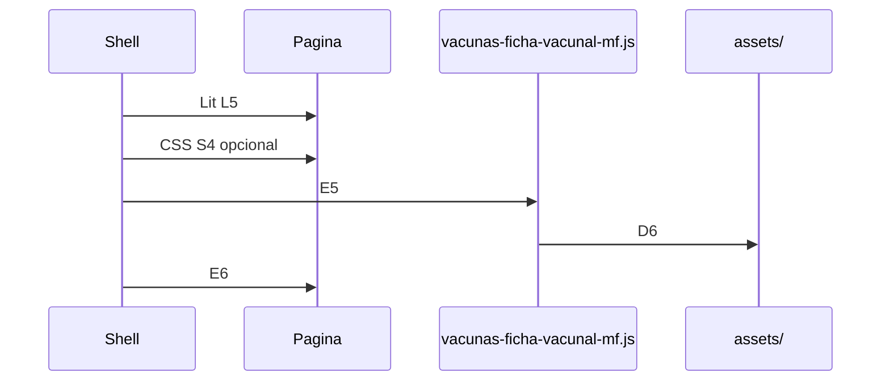

# Integración con el shell

Guía de **implementación shell ↔ MFE**.
Estructura interna frontend: [FRONTEND_STRUCTURE.md](./FRONTEND_STRUCTURE.md).

---

## Prerrequisitos

1. Contrato leído: **E**, **D**, **L**, **S**, **B**, **I**, **R7**.
2. Artefacto de release disponible (salida de pipeline; cumple **D1**).
3. Acordado: URL base (**B1** o **B2**) y modo CSS (**S3** o **S4**).

---

## Impacto de la estructura modular en integración

- El entry público de integración permanece en `src/index.ts` (**E4**).
- Este archivo importa el router (`src/routing/vacunas-ficha-vacunal-router.view.ts`) el cual registra el custom element principal y engloba la UI.
- Los tipos y nombres de los eventos se exponen explícitamente desde este entry para facilitar la integración en Typescript por parte del shell.

---

## Flujo de carga en runtime



| Orden | Acción                         | Reglas                 |
| ----- | ------------------------------ | ---------------------- |
| 1     | Configurar resolución de `lit` | **L5**, **L1**         |
| 2     | Publicar artefacto en URL base | **D2**, **D6**, **I3** |
| 3     | Cargar CSS global si aplica    | **S4**                 |
| 4     | Cargar entry (ESM)             | **E5**, **E7**         |
| 5     | Montar custom element          | **E6**                 |

---

## Resolver `lit` — import map

Ver **L1**, **L5**, **L7**.

```html
<script type="importmap">
  {
    "imports": {
      "lit": "https://static.ejemplo.internal/shared/lit/2.7.4/lit.min.js",
      "lit/": "https://static.ejemplo.internal/shared/lit/2.7.4/"
    }
  }
</script>
```

---

## URL base del artefacto

`BASE` = raíz donde coexisten `vacunas-ficha-vacunal-mf.js` y `assets/` (**D6**, **I3**).

Subruta: **B2**, **B3**. Coordinar `base` de build del MFE y proxy.

---

## Cargar entry — `import()` (HTML)

Ver **E5**, **S4**, **D2**, **E6**.

```html
<script type="importmap">
  {
    "imports": {
      "lit": "https://static.ejemplo.internal/shared/lit/2.7.4/lit.min.js",
      "lit/": "https://static.ejemplo.internal/shared/lit/2.7.4/"
    }
  }
</script>

<div id="mfe-root"></div>

<script type="module">
  const BASE = 'https://static.ejemplo.internal/vacunas-ficha-vacunal-mf/1.0.0';

  const link = document.createElement('link');
  link.rel = 'stylesheet';
  link.href = `${BASE}/assets/style-XXXX.css`;
  document.head.appendChild(link);

  await import(`${BASE}/vacunas-ficha-vacunal-mf.js`);

  document.getElementById('mfe-root').innerHTML =
    '<vacunas-ficha-vacunal-mf nuhsa="NUHSA001"></vacunas-ficha-vacunal-mf>';
</script>
```

---

## Cargar entry — TypeScript

Ver **E5**, **S4**, **E6**.

```typescript
const MFE_BASE = 'https://static.ejemplo.internal/vacunas-ficha-vacunal-mf/1.0.0';

export async function mountVacunasFichaVacunalMf(
  container: HTMLElement,
  options?: { cssHref?: string }
): Promise<void> {
  if (options?.cssHref) {
    const link = document.createElement('link');
    link.rel = 'stylesheet';
    link.href = options.cssHref;
    document.head.appendChild(link);
  }

  await import(/* @vite-ignore */ `${MFE_BASE}/vacunas-ficha-vacunal-mf.js`);
  const el = document.createElement('vacunas-ficha-vacunal-mf');
  el.setAttribute('nuhsa', 'NUHSA001');
  container.replaceChildren(el);
}
```

---

## Configuración y Eventos MFE

El componente web emitirá eventos para comunicar su estado al shell:

- `vacunas-ficha-vacunal-mf:loaded`
- `vacunas-ficha-vacunal-mf:error`
- `vacunas-ficha-vacunal-mf:card-selected`

La lógica de bootstrap inicializa el MFE obteniendo la configuración de runtime; si falla el proceso, se emite el evento de error.

---

## Depuración

| Síntoma                                    | Reglas a verificar                     |
| ------------------------------------------ | -------------------------------------- |
| `Failed to resolve module specifier "lit"` | **L4**, **L5**                         |
| 404 en `assets/*.js`                       | **D2**, **D3**, **D6**, **B2**, **I3** |
| Pantalla en blanco tras entry              | **E7**, **C4**, **I2**, **L7**         |
| _Multiple versions of Lit loaded_          | **I1**, **L6**, **L3**                 |
